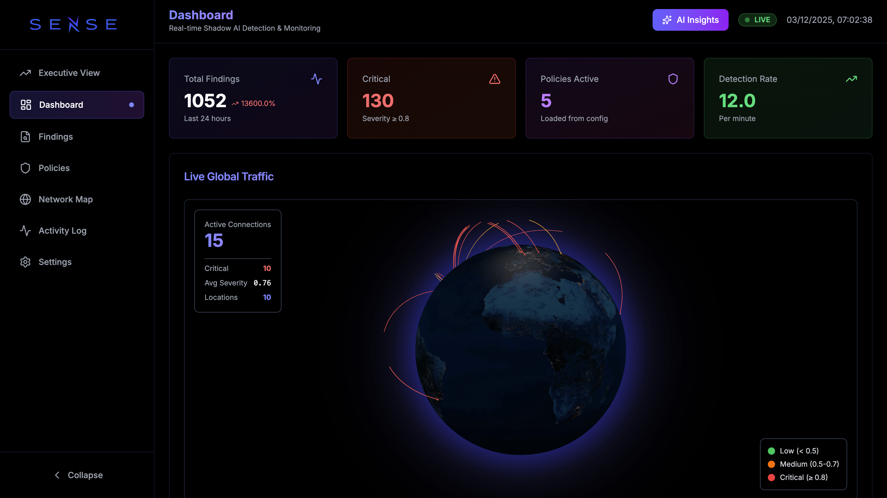

<div align="center">
  
  <h1>SENSE: Shadow Exposure & eNterprise Surveillance for AI</h1>
  
  [](https://go.dev/)
  [](https://opensource.org/licenses/MIT)
  [](https://www.apple.com/macos/)
</div>

<br />

**SENSE** (Shadow Exposure & eNterprise Surveillance for AI) is a comprehensive security tool designed to detect and monitor unauthorized or "shadow" AI instances within enterprise environments. By analyzing network traffic and endpoint processes, SENSE identifies potential AI-related activities, such as API calls to external AI services (e.g., OpenAI, Hugging Face) or local AI model execution. This enhances enterprise visibility and mitigates risks associated with unapproved AI usage.

> **Note**: This project is under active development for presentation at Black Hat MEA, focusing on robust detection of shadow AI in enterprise networks.

---

## 📋 Table of Contents

- [Features](#-features)
- [Prerequisites](#-prerequisites)
- [Installation](#-installation)
- [Usage](#-usage)
- [Troubleshooting](#-troubleshooting)
- [Project Structure](#-project-structure)
- [License](#-license)

---

## 🚀 Features

- **Network Traffic Analysis**: Captures HTTP/HTTPS traffic using `libpcap` and `gopacket` to detect AI API calls (e.g., `api.openai.com`, `api.huggingface.co`).
- **Endpoint Scanning**: Simulates detection of AI-related processes (e.g., Python with TensorFlow) via a placeholder implementation.
- **REST API**: Exposes findings through a JSON-based API (`/findings`) powered by Gin.
- **Real-time Dashboard**: A modern React-based UI to visualize findings, network traffic, and threat levels.
- **SQLite Storage**: Logs findings with details (source/destination IPs, ports, headers, severity) in a local SQLite database.
- **Command-Line Interface**: Built with Cobra for easy scanning (`sense scan`) and API server management (`sense api`).

---

## 🛠 Prerequisites

- **Go**: Version 1.23.2 or later
- **Node.js**: Version 18 or later (for Frontend)
- **libpcap**: Version 1.10.5 or later (installed via Homebrew on macOS)
- **macOS**: Tested on Apple Silicon (M1/M2)

---

## 📦 Installation

### 1. Clone the Repository
```bash
git clone https://github.com/Faux16/sense-ai.git
cd sense-ai
```

### 2. Install Backend Dependencies
```bash
go mod tidy
```

### 3. Install Frontend Dependencies
```bash
cd internal/ui/frontend
npm install
cd ../../..
```

### 4. Install libpcap (macOS)
```bash
brew install libpcap
export PKG_CONFIG_PATH=/opt/homebrew/Cellar/libpcap/1.10.5/lib/pkgconfig:$PKG_CONFIG_PATH
export CGO_CFLAGS="-I/opt/homebrew/Cellar/libpcap/1.10.5/include"
export CGO_LDFLAGS="-L/opt/homebrew/Cellar/libpcap/1.10.5/lib"
```

### 5. Build SENSE Backend
```bash
go build -o sense cmd/sense/main.go
```

---

## 💻 Usage

### 1. Start the Frontend
Open a terminal and run:
```bash
cd internal/ui/frontend
npm run dev
```
The UI will be available at [http://localhost:5173/ui/](http://localhost:5173/ui/).

### 2. Start the Backend
You can run the backend in two modes:

#### Mode A: Full Functionality (Requires Sudo)
Enables network traffic analysis. Requires root privileges to capture packets.
```bash
# Use /tmp/sense.db to avoid permission issues with root
sudo ./sense api --port 8080 --db /tmp/sense.db
```

#### Mode B: Limited Functionality (No Sudo)
Runs without network scanning (Endpoint detection only).
```bash
./sense api --port 8080 --db /tmp/sense.db
```

> **Note**: We use `--db /tmp/sense.db` to avoid file permission conflicts between `sudo` and user execution.

---

## 🔧 Troubleshooting

### Database Permission Errors
If you see `attempt to write a readonly database` or `permission denied`:
1. Use the `--db /tmp/sense.db` flag as shown above.
2. Or, fix ownership of the local DB: `sudo chown $(whoami) sense.db`.

### Network Scanning Fails
If you see `permission denied` for `/dev/bpf0`:
- You must run the backend with `sudo`.

### Frontend "Black Screen"
- Ensure you are accessing the correct URL: `http://localhost:5173/ui/`.
- Check the browser console for errors.

---

## 📂 Project Structure
```
cmd/sense/      # Entry point (main.go)
internal/
  ├── action/   # Remediation logic (block IP, kill process)
  ├── api/      # REST API server
  ├── detector/ # Network and Endpoint detectors
  ├── policy/   # Policy engine and rules
  ├── storage/  # SQLite database handler
  └── ui/       # Frontend React application
```

---

## 📄 License
MIT License.
