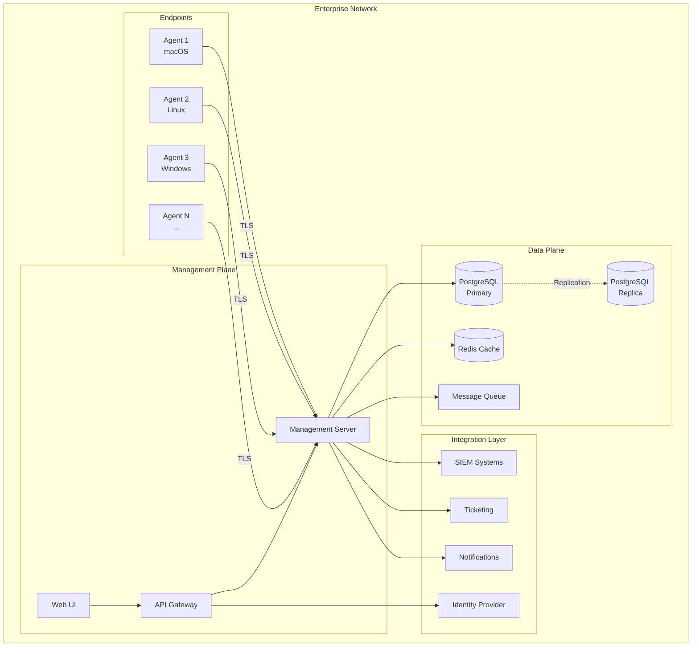
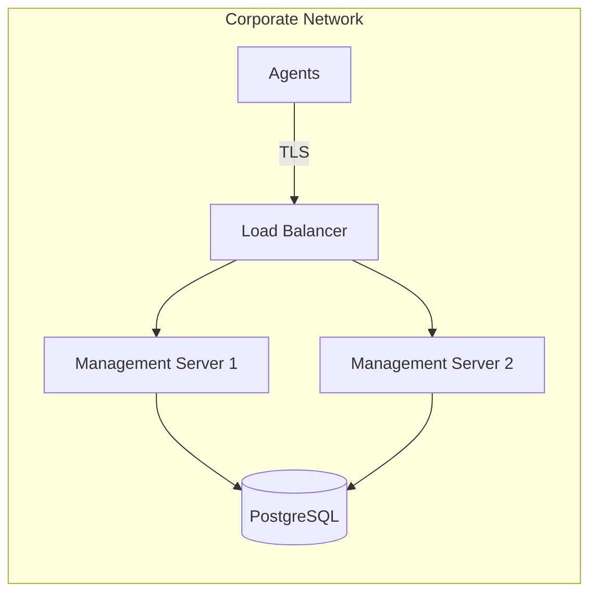
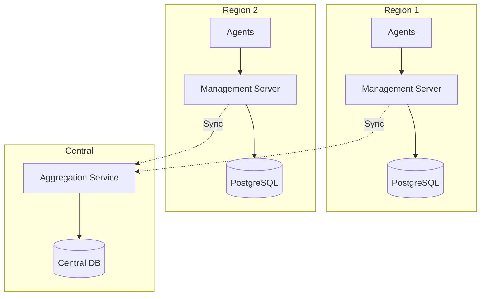
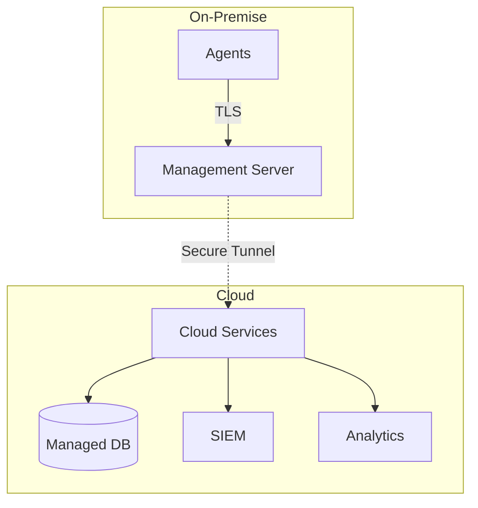
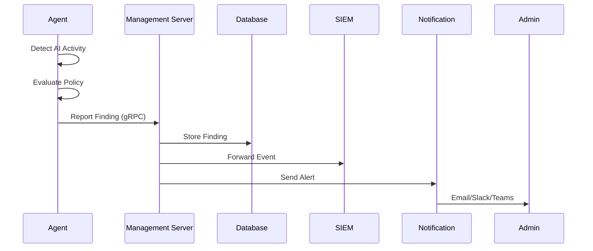
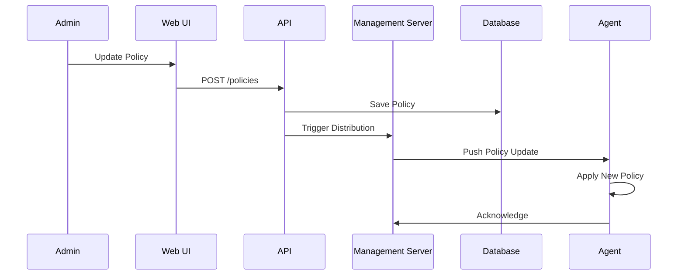

# SENSE Enterprise Architecture

## Overview

SENSE Enterprise is designed as a distributed system with a centralized management architecture. The system consists of lightweight agents deployed across endpoints that communicate with a central management server for policy distribution, finding aggregation, and centralized monitoring.

## System Components



### 1. SENSE Agent

**Purpose**: Lightweight endpoint monitoring agent

**Responsibilities**:
- Network traffic capture and analysis
- Endpoint process scanning
- Policy enforcement
- Finding detection and reporting
- Secure communication with management server

**Technical Details**:
- Written in Go for cross-platform support
- Minimal resource footprint (< 100MB RAM, < 5% CPU)
- Auto-update capability
- Graceful degradation when offline

**Deployment**:
- Runs as system service (systemd, launchd, Windows Service)
- Requires elevated privileges for network capture
- Configuration via local file or remote management

### 2. Management Server

**Purpose**: Central orchestration and coordination

**Responsibilities**:
- Agent registration and lifecycle management
- Policy distribution and versioning
- Finding aggregation and correlation
- Health monitoring and alerting
- Integration orchestration

**Technical Details**:
- Horizontally scalable Go service
- Stateless design for easy scaling
- gRPC for agent communication
- REST API for UI and integrations

**High Availability**:
- Active-active deployment with load balancing
- Shared state in PostgreSQL and Redis
- Automatic failover

### 3. API Gateway

**Purpose**: Unified API interface

**Responsibilities**:
- Authentication and authorization
- Rate limiting and throttling
- API versioning
- Request routing
- Audit logging

**Technical Details**:
- JWT-based authentication
- Role-based access control (RBAC)
- OpenAPI 3.0 specification
- Multi-tenant isolation

### 4. Web UI

**Purpose**: Administrative interface

**Responsibilities**:
- Dashboard and visualization
- Agent management
- Policy configuration
- User management
- Reporting and analytics

**Technical Details**:
- React + TypeScript
- Real-time updates via WebSocket
- Responsive design
- Role-based UI elements

### 5. PostgreSQL Database

**Purpose**: Persistent data storage

**Schema Design**:
- Multi-tenant with organization isolation
- Partitioned tables for findings (by date)
- Optimized indexes for common queries
- Retention policies for data archival

**Tables**:
- `organizations`: Tenant isolation
- `agents`: Agent registry
- `findings`: Detection results
- `policies`: Policy definitions
- `users`: User accounts
- `audit_logs`: Compliance logging

**Performance**:
- Connection pooling (pgbouncer)
- Read replicas for reporting
- Automated backups and point-in-time recovery

### 6. Redis Cache

**Purpose**: High-performance caching and session storage

**Use Cases**:
- API response caching
- Session management
- Rate limiting counters
- Real-time agent status
- Pub/sub for real-time updates

### 7. Message Queue

**Purpose**: Asynchronous processing

**Use Cases**:
- Finding processing pipeline
- Integration event delivery
- Batch operations
- Scheduled tasks

**Technology**: RabbitMQ or Redis Streams

---

## Deployment Models

### Model 1: Centralized (Recommended for < 5,000 agents)



**Characteristics**:
- Single management cluster
- Centralized database
- Simple to operate
- Lower infrastructure cost

**Scaling Limits**:
- Up to 5,000 agents
- 10,000 findings/second
- 99.9% availability

### Model 2: Distributed (Recommended for > 5,000 agents)



**Characteristics**:
- Regional management servers
- Data aggregation to central location
- Reduced latency for agents
- Higher availability

**Scaling Limits**:
- 50,000+ agents
- 100,000+ findings/second
- 99.99% availability

### Model 3: Hybrid Cloud



**Characteristics**:
- On-premise agents and management
- Cloud-based data storage and analytics
- Compliance with data residency requirements
- Leverage cloud services for scale

---

## Communication Protocols

### Agent-Server Communication

**Protocol**: gRPC over TLS 1.3

**Endpoints**:
- `RegisterAgent`: Initial agent registration
- `Heartbeat`: Periodic health check (every 30s)
- `GetPolicies`: Policy synchronization
- `ReportFindings`: Batch finding submission
- `GetCommands`: Remote command execution

**Message Format**:
```protobuf
message AgentRegistration {
  string agent_id = 1;
  string hostname = 2;
  string os = 3;
  string version = 4;
  string organization_id = 5;
  map<string, string> metadata = 6;
}

message Finding {
  string id = 1;
  string agent_id = 2;
  int64 timestamp = 3;
  string type = 4;
  string severity = 5;
  string source_ip = 6;
  string dest_ip = 7;
  map<string, string> details = 8;
}
```

**Security**:
- Mutual TLS (mTLS) authentication
- Certificate-based agent identity
- Certificate rotation every 90 days

### API Communication

**Protocol**: REST over HTTPS

**Authentication**:
- JWT tokens (15-minute expiry)
- Refresh tokens (7-day expiry)
- API keys for service accounts

**Rate Limiting**:
- 1000 requests/minute per user
- 10,000 requests/minute per organization
- Burst allowance of 2x limit

---

## Data Flow

### Finding Detection Flow



### Policy Update Flow



---

## Scalability Considerations

### Horizontal Scaling

**Management Server**:
- Stateless design allows unlimited horizontal scaling
- Load balancer distributes agent connections
- Session affinity not required

**Database**:
- Read replicas for reporting queries
- Partitioning by date for findings table
- Sharding by organization_id for multi-tenancy

**Caching**:
- Redis cluster for distributed caching
- Cache-aside pattern for frequently accessed data
- TTL-based cache invalidation

### Vertical Scaling

**Recommended Specifications**:

| Component | Small (< 1K agents) | Medium (1K-5K agents) | Large (5K-20K agents) |
|-----------|---------------------|----------------------|----------------------|
| Management Server | 2 vCPU, 4GB RAM | 4 vCPU, 8GB RAM | 8 vCPU, 16GB RAM |
| PostgreSQL | 2 vCPU, 8GB RAM | 4 vCPU, 16GB RAM | 8 vCPU, 32GB RAM |
| Redis | 2 vCPU, 4GB RAM | 4 vCPU, 8GB RAM | 8 vCPU, 16GB RAM |

### Performance Targets

- **Agent Registration**: < 100ms
- **Heartbeat Processing**: < 50ms
- **Finding Ingestion**: < 200ms
- **API Response Time**: < 100ms (p95)
- **UI Load Time**: < 2s
- **Database Query**: < 50ms (p95)

---

## Security Architecture

### Defense in Depth

1. **Network Layer**:
   - TLS 1.3 for all communications
   - Network segmentation
   - Firewall rules

2. **Application Layer**:
   - Input validation
   - SQL injection prevention (parameterized queries)
   - XSS prevention (content security policy)
   - CSRF protection

3. **Authentication Layer**:
   - Multi-factor authentication (MFA)
   - Password complexity requirements
   - Account lockout after failed attempts
   - SSO integration

4. **Authorization Layer**:
   - Role-based access control (RBAC)
   - Principle of least privilege
   - Multi-tenant isolation
   - Audit logging

5. **Data Layer**:
   - Encryption at rest (AES-256)
   - Encryption in transit (TLS 1.3)
   - Database access controls
   - Secrets management (Vault)

### Compliance

**Supported Standards**:
- SOC 2 Type II
- ISO 27001
- GDPR
- HIPAA (with additional controls)
- PCI DSS (for payment data)

**Audit Logging**:
- All API calls logged
- User actions tracked
- Policy changes recorded
- Finding lifecycle documented
- Retention: 1 year minimum

---

## Disaster Recovery

### Backup Strategy

**Database**:
- Automated daily backups
- Point-in-time recovery (PITR)
- Cross-region replication
- Retention: 30 days

**Configuration**:
- Version-controlled in Git
- Automated configuration backup
- Secrets backed up in Vault

### Recovery Objectives

- **RTO (Recovery Time Objective)**: 1 hour
- **RPO (Recovery Point Objective)**: 5 minutes

### Failover Procedures

1. **Management Server Failure**:
   - Automatic failover via load balancer
   - Health checks every 10 seconds
   - No data loss

2. **Database Failure**:
   - Automatic promotion of replica
   - DNS update for connection string
   - < 5 minutes downtime

3. **Complete Region Failure**:
   - Manual failover to DR region
   - Restore from backup
   - < 1 hour downtime

---

## Monitoring and Observability

### Metrics (Prometheus)

**System Metrics**:
- CPU, memory, disk usage
- Network throughput
- Database connections
- Cache hit rate

**Application Metrics**:
- Agent count (online/offline)
- Finding rate
- API request rate
- Error rate
- Response time (p50, p95, p99)

**Business Metrics**:
- Findings by severity
- Top AI services detected
- Policy violations
- Coverage (agents/endpoints)

### Logging (ELK Stack)

**Log Levels**:
- ERROR: System errors requiring attention
- WARN: Potential issues
- INFO: Normal operations
- DEBUG: Detailed troubleshooting

**Structured Logging**:
```json
{
  "timestamp": "2025-12-04T09:15:00Z",
  "level": "INFO",
  "service": "management-server",
  "agent_id": "agent-123",
  "message": "Finding reported",
  "finding_id": "finding-456",
  "severity": "HIGH"
}
```

### Alerting

**Critical Alerts** (PagerDuty):
- Management server down
- Database connection failure
- > 50% agents offline
- Disk space > 90%

**Warning Alerts** (Slack):
- High error rate (> 1%)
- Slow response time (> 500ms)
- > 20% agents offline
- Policy distribution failure

### Tracing (Jaeger)

- Distributed tracing across services
- Request flow visualization
- Performance bottleneck identification
- Error root cause analysis

---

## Technology Stack

### Backend
- **Language**: Go 1.23+
- **API Framework**: Gin (REST), gRPC
- **Database**: PostgreSQL 15+
- **Cache**: Redis 7+
- **Message Queue**: RabbitMQ or Redis Streams

### Frontend
- **Framework**: React 18+
- **Language**: TypeScript
- **Build Tool**: Vite
- **UI Library**: shadcn/ui
- **State Management**: React Query
- **Real-time**: WebSocket

### Infrastructure
- **Container**: Docker
- **Orchestration**: Kubernetes
- **IaC**: Terraform
- **Configuration**: Ansible
- **CI/CD**: GitHub Actions

### Monitoring
- **Metrics**: Prometheus + Grafana
- **Logging**: ELK Stack (Elasticsearch, Logstash, Kibana)
- **Tracing**: Jaeger
- **Alerting**: Prometheus Alertmanager + PagerDuty

---

## Next Steps

1. Review and approve architecture
2. Set up development environment
3. Implement management server core
4. Develop agent-server protocol
5. Build admin UI
6. Deploy to staging environment
7. Load testing and optimization
8. Production deployment
